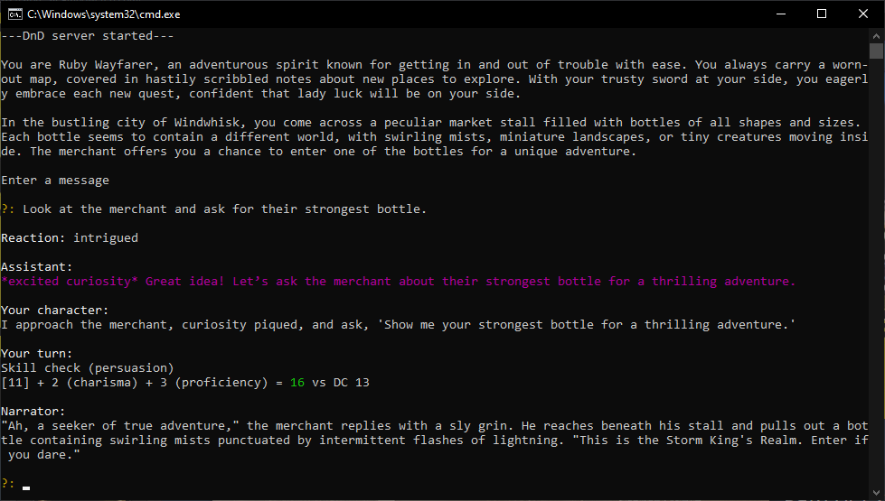
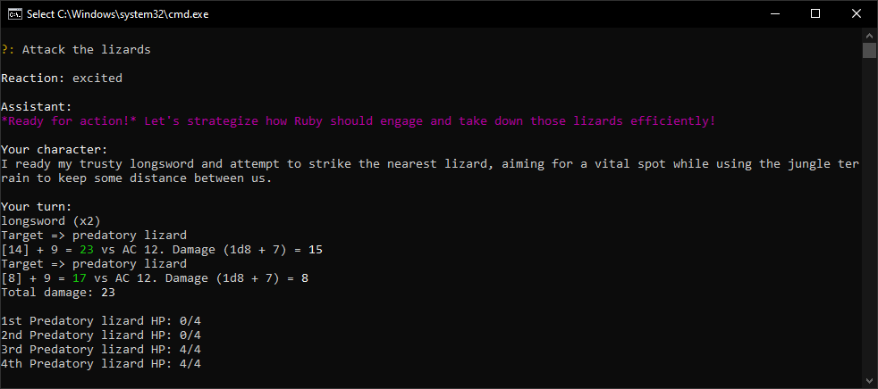
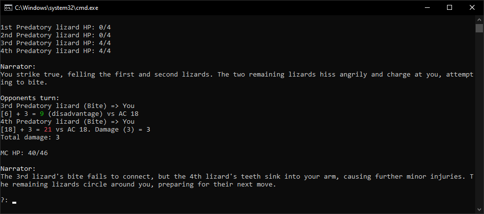

# Dungeons-and-Zeros

## Description

Dungeons and Zeros is a GPT-powered agent that lets you experience a fully AI-driven Dungeons & Dragons game. It acts as both the game master and the character in the game, managing rules, dice rolls, and story progression based on your prompts.

## Installation

Tested on python version 3.10.

### OpenAI API

This project requires an OpenAI account to access the GPT-4o or GPT-4o-mini models via the OpenAI API. To use the API, set an environment variable named "OPENAI_API_KEY" with your API key.

On windows, run the following file to save the api key as an environment variable.
```
set_open_ai_key.bat
```

On Linux, run the following commands to save the api key as an environment variable:
```
chmod +x set_openai_key.sh  
./set_openai_key.sh
```

### Windows

Run the following files in order to install and then run the program:
```
setup.bat  
run_ai.bat
```

### Linux

Run the following commands in order to install and then run the program:
```
chmod +x setup.sh  
./setup.sh  
chmod +x run_ai.sh  
./run_ai.sh
```

## Screenshots

### New game example


### Battle example

