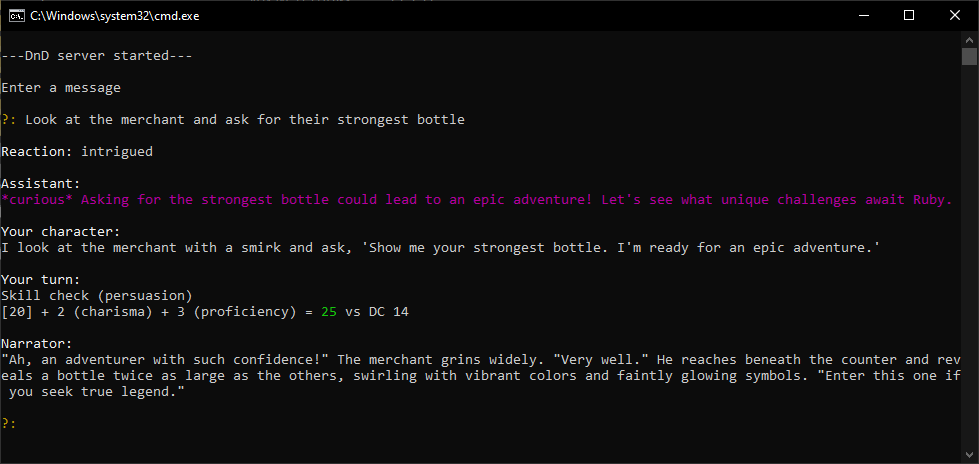

# Dungeons-and-Zeros

## Description

Dungeons and Zeros is a GPT-powered agent that lets you experience a fully AI-driven Dungeons & Dragons game. It acts as both the game master and player, managing rules, dice rolls, and story progression based on your prompts.

## Installation

Tested on python version 3.10

### OpenAI

This project uses the openAI api to query either gpt3.5 or gpt4, an OpenAI account is thus required to use our system. To use the OpenAI API, create an environment variable called "OPENAI_API_KEY" containing your full API key.

### Windows

Run setup.bat
Run run_ai.bat

### Linux

./setup.sh
./run_ai.sh

### Screenshots

